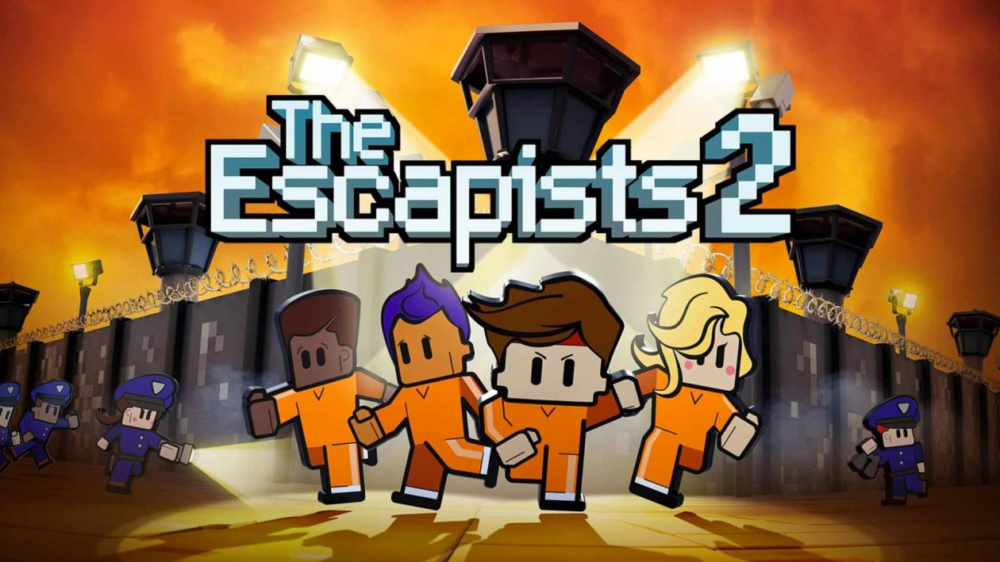

# Tools

## 📱 App Iphone in Window

- AltServer
- ICloud
- iTunes

<a href="">Google Driver</a>

##   MacOS 

## 🚀 We need to go deeper 

Crew a submarine with friends in We Need To Go Deeper - a 2-4-player cooperative submarine roguelike set in a Verne-inspired undersea universe

<a href="https://drive.google.com/file/d/149fGT-3ZOLnqDE9TGKB5dbx-40Gh1TqG/view?usp=sharing">Link</a>

## 🚀 The Escapists 2 

The Escapists 2 is a strategy role-playing video game developed by Mouldy Toof Studios and published by Team17. It is the sequel to The Escapists and it was released worldwide for Microsoft Windows, macOS, Linux, PlayStation 4 and Xbox One in August

<a href="https://drive.google.com/file/d/1JieyuVk2Pq_6_UFknkX5j-wR_2Muwd6i/view?usp=sharing">Link</a>

## 💻 Another Apps

