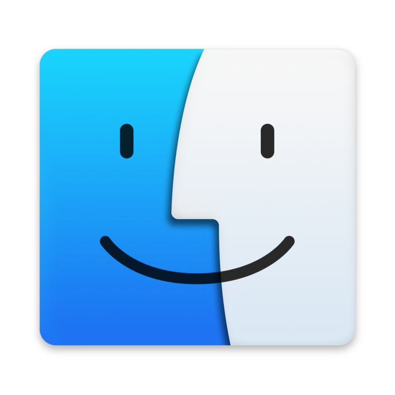

# Tools

## 📱 App Iphone in Window

- AltServer
- ICloud
- iTunes

<a href="https://drive.google.com/file/d/1YgGzOhqG1fsTvq1EIyj7MEKgGXYl7vfC/view?usp=sharing">Google Driver</a>

##   MacOS 

<a href="https://drive.google.com/file/d/1T4p795aJHHNS-L2rjulv4EtO4LkJYy9m/view">MacOS BigSur</a>

## 🚀 We need to go deeper 

Crew a submarine with friends in We Need To Go Deeper - a 2-4-player cooperative submarine roguelike set in a Verne-inspired undersea universe

<a href="https://drive.google.com/file/d/149fGT-3ZOLnqDE9TGKB5dbx-40Gh1TqG/view?usp=sharing">We need to go deeper</a>

## 🚀 The Escapists 2 

The Escapists 2 is a strategy role-playing video game developed by Mouldy Toof Studios and published by Team17. It is the sequel to The Escapists and it was released worldwide for Microsoft Windows, macOS, Linux, PlayStation 4 and Xbox One in August

<a href="https://drive.google.com/file/d/1JieyuVk2Pq_6_UFknkX5j-wR_2Muwd6i/view?usp=sharing">The Escapists 2</a>

## 💻 Another Apps

<a href="https://drive.google.com/drive/folders/10v5i1LA91wD5biobKQuC7u1R2gpwWrJx?usp=sharing">Google Driver</a>

## 🖥️ Win10

<a href="https://docs.google.com/uc?id=1_qHdog1BSQYt5YxThEqpyaTE0PkV-2fY">Google Driver</a>

